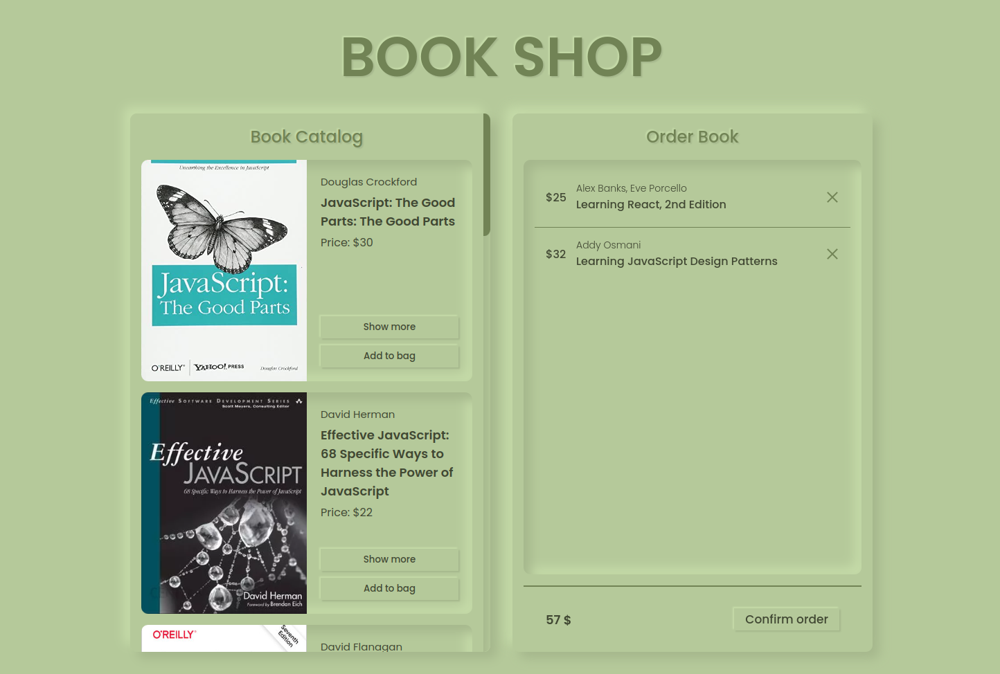

# book-shop

- https://g0sie.github.io/book-shop

The project simulates an online book shop. It was made for [RS School - JS/Frontend development course](https://rs.school/js-en/). The purpose of [the task](https://github.com/rolling-scopes-school/js-fe-course-en/blob/main/tasks/books-shop/books-shop.md) was to build almost whole website using only Javascript and CSS. The only thing that was built with HTML is a delivery form, which was built to learn form validation.

## Acknowledgements

- Here's where I got a [favicon](https://uxwing.com/study-icon/) from.
- And here's where I learned [how to build drag & drop](https://youtu.be/jfYWwQrtzzY) from.
